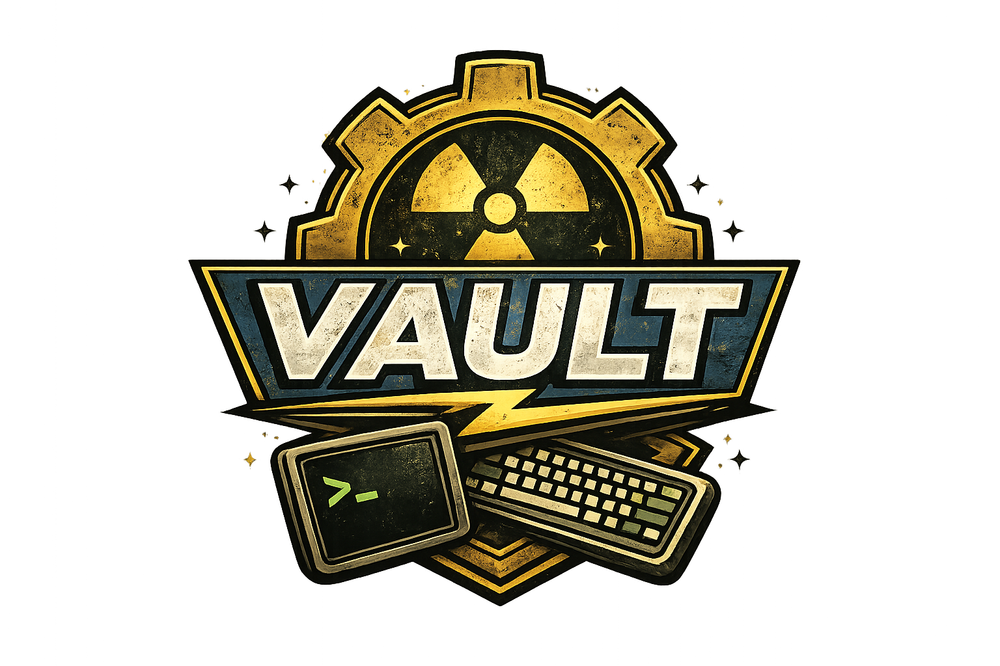

<h1 align="center">
    
</h1>

**vault** is a Neovim colorscheme (pure Lua plugin) inspired by the phosphor terminals of the Fallout universe and the iconic green cascade of The Matrix. It uses a warm amber phosphor base with Matrix green accents against a near-black background — dark, retro-futuristic, and built for programmers who live in the terminal.

**Core Value:** A colorscheme that feels like hacking from inside a Vault-Tec terminal — amber phosphor dominates, Matrix green punctuates, and every highlight group serves readability over decoration.

## Demo


## Install

```lua
{
  "mCassy/vault",
  priority = 1000,
  lazy = false,
  config = function()
    require("vault").setup({
      transparent = false,
    })
    vim.cmd.colorscheme("vault")
  end,
}
```

## Setup options

```lua
require("vault").setup({
  transparent = false,      -- true = use terminal bg instead of #0a0a00
  terminal_colors = true,   -- set vim.g.terminal_color_0..15
  italics = {               -- or set `italics = true/false` for all
    comments = true,
    keywords = false,
    functions = false,
    strings = false,
    variables = false,
    parameters = false,
  },
  overrides = {             -- any highlight group, merged over defaults
    Comment = { fg = "#7a7000", italic = true },
  },
})
```

Passing `transparent = true` swaps the editor background (Normal / NormalNC / SignColumn / FoldColumn / WinBar / CursorLine / CursorColumn / StatusLine / TabLine / Pmenu / NormalFloat / FloatBorder / telescope + noice + blink + snacks floats / bufferline fill / diagnostic virtual text) to `NONE` so your terminal background shows through.

## Supported plugins

- Telescope, FzfLua, Snacks picker
- nvim-cmp, blink.cmp
- GitSigns
- Bufferline, Mini.tabline
- Neo-tree, nvim-tree
- Which-key, Lazy.nvim, Mason
- Noice, nvim-notify, Trouble
- Flash, Leap
- Mini (cursorword, indentscope, starter, statusline, tabline, test, surround, jump, trailspace)
- Nvim-navic, Dashboard, Alpha
- Indent Blankline / ibl v3

## Palette

| Name    | Hex     | Role                            |
| ------- | ------- | ------------------------------- |
| bg      | #0a0a00 | Background                      |
| fg      | #c8b400 | Primary text (amber phosphor)   |
| green   | #00ff41 | Keywords, accent (Matrix green) |
| comment | #5a5200 | Comments                        |
| string  | #7aff00 | String literals                 |
| ui_bg   | #2a2800 | UI chrome, float windows        |
| error   | #cc4400 | Errors, git delete              |
| warning | #c87000 | Warnings                        |

## Ghostty

1. Copy `extras/ghostty/vault` to `~/.config/ghostty/themes/vault`
2. Add `theme = vault` to `~/.config/ghostty/config`
